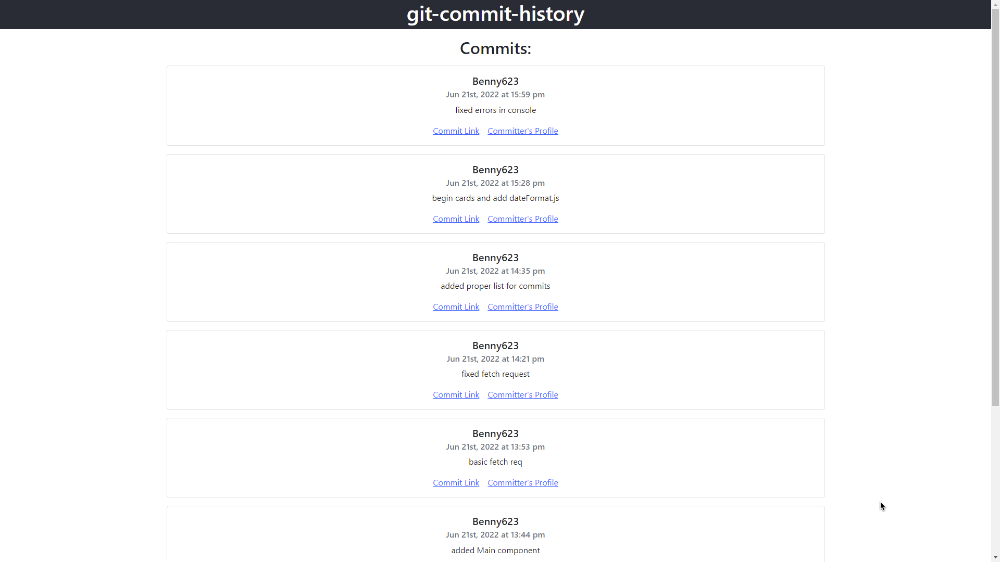

# git-commit-history

## Description

An example app displaying the commit history for this repository.

- Built With:
    * JavaScript
    * Node.js
    * React
    * Bootstrap

## Installation

After you have cloned the repository, you must CD into that directory and use the following command to install the required packages:

~~~
npm install
~~~

## Testing

After the install is finished, run the following command to start the app:

~~~
npm start
~~~

* Access the app by navigating to http://localhost:3001/

## Links
* [Heroku Deployment](https://bm-git-commit-history.herokuapp.com/)